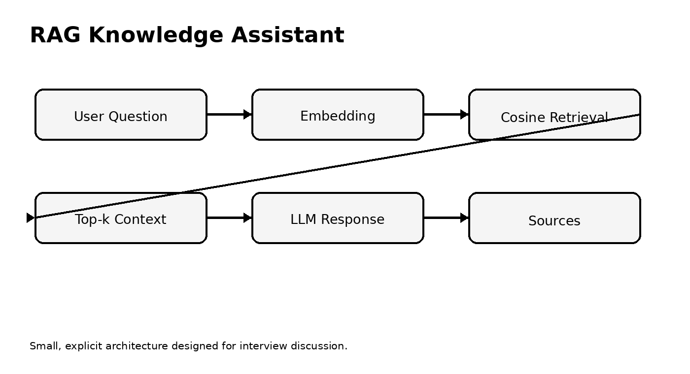

# RAG Knowledge Assistant

A small, interview-friendly Retrieval-Augmented Generation (RAG) application built with **Python, Streamlit, OpenAI embeddings, cosine similarity, and the OpenAI Responses API**.

## What it demonstrates

- Document ingestion from local Markdown/text files
- Embedding-based semantic retrieval
- Top-k context selection
- Grounded LLM answers with source names
- A simple, understandable RAG pipeline
- Streamlit UI
- No framework magic: retrieval logic is implemented directly in Python

## Architecture



```text
User question
     |
     v
Streamlit UI
     |
     v
OpenAI embedding
     |
     v
Cosine similarity search
     |
     v
Top-k document chunks
     |
     v
Prompt + retrieved context
     |
     v
OpenAI Responses API
     |
     v
Answer + sources
```

## Quick start

```bash
python -m venv .venv
# Windows
.venv\Scripts\activate
# macOS/Linux
source .venv/bin/activate

pip install -r requirements.txt
copy .env.example .env
```

Add your API key to `.env`:

```env
OPENAI_API_KEY=your_key_here
OPENAI_MODEL=gpt-5.6-luna
EMBEDDING_MODEL=text-embedding-3-small
```

Run:

```bash
streamlit run app.py
```

## Demo questions

Try:

- `How many vacation days do employees receive?`
- `What is the remote work policy?`
- `What happens if a laptop is damaged?`

## Interview explanation

**Why RAG?** The model should answer from company-specific documents rather than relying only on model knowledge.

**Why embeddings?** They let us retrieve semantically related chunks even when the wording of the question differs from the wording in the document.

**Why cosine similarity?** It is a simple and transparent way to rank embedding vectors.

**What would I improve for production?**

- Persistent vector database such as pgvector/Qdrant
- Chunking based on document structure
- Metadata filtering
- Retrieval evaluation
- Reranking
- Authentication and observability
- Streaming responses and caching
